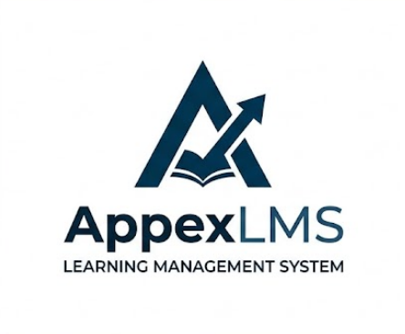
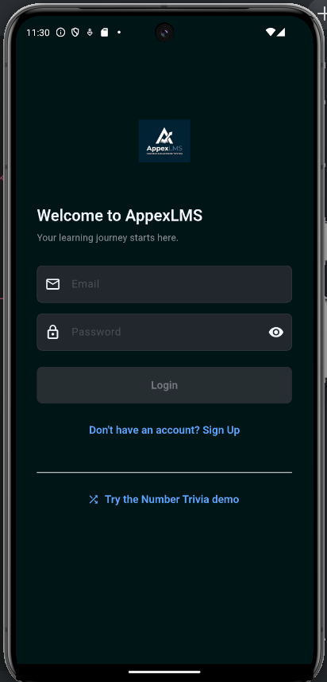
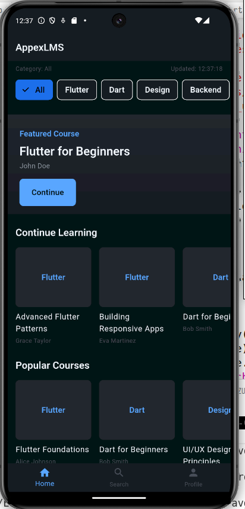
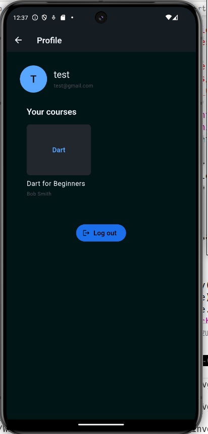

# AppexLMS

A **Learning Management System** built with Flutter, designed as a guided project to master Flutter architecture and development.

<p align="center">
  
</p>

<p align="center">
  <a href="https://flutter.dev"></a>
  <a href="https://dart.dev"></a>
  <a href="https://firebase.google.com"></a>
</p>

## Key Concepts

| # | Concept | Focus |
|---|---------|-------|
| 1 | Imperative vs Declarative Programming | Understanding Flutter's declarative UI paradigm |
| 2 | Clean Flutter Architecture | Separation of concerns across data, domain, and presentation layers |
| 3 | UI Principles | Even-number dimensions, Expanded/Flexible, Rows & Columns, Netflix-style UI |
| 4 | State Management | GetX: GetBuilder, GetxController, .obs, Obx |
| 5 | Database Integration | CRUD with Supabase (PostgreSQL) and MongoDB |


## Architecture

```
lib/
├── app/                  # App-level config
│   ├── theme/            # Light/dark themes, spacing scale
│   ├── routes/           # GetX route definitions
│   └── bindings/         # GetX dependency bindings
├── data/                 # Data layer
│   ├── models/           # JSON/domain mapping
│   ├── providers/         # Supabase/MongoDB API calls
│   └── repositories/      # Repository implementations
├── domain/               # Domain layer (pure business logic)
│   ├── entities/         # Domain objects
│   └── repositories/      # Repository interfaces (abstract)
├── modules/              # Feature modules
│   ├── auth/             # Login/Register
│   ├── dashboard/        # Netflix-style course browser
│   ├── courses/          # Course detail & lessons
│   └── profile/          # User profile & settings
└── main.dart
```

## Tech Stack

- **Framework:** Flutter 3.x (Dart)
- **State Management:** GetX
- **Database (Primary):** Supabase (PostgreSQL)
- **Database (Secondary):** MongoDB Atlas
- **UI Style:** Netflix-inspired layout with consistent even-number dimension convention

## UI Convention

All dimensions (padding, margin, sizing, border-radius) use even numbers based on a 4px unit scale:

| Token | Value |
|-------|-------|
| `xs`  | 4px   |
| `sm`  | 8px   |
| `md`  | 16px  |
| `lg`  | 24px  |
| `xl`  | 32px  |
| `2xl` | 48px  |
| `3xl` | 64px  |

## Progress Tracking

- [Sprints](./Sprints.md) — Sprint-by-sprint development progress
- [Testing](./Testing.md) — Test results and coverage tracking

## Getting Started

```bash
# Clone the repository
git clone <repo-url>
cd appex

# Install dependencies
flutter pub get

# Run the app
flutter run
```


## 📸 Screenshots

| Auth Screen | Home | Profile |
|-------------|---------|--------|
|  |  |  


